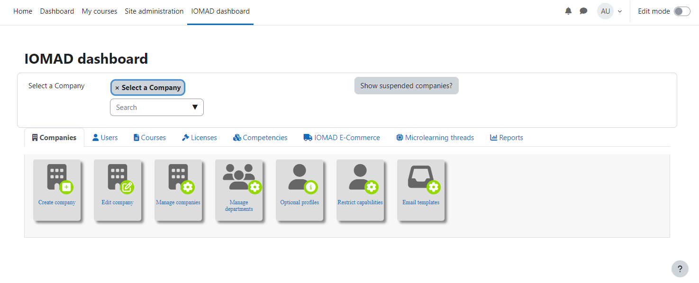

# IOMAD CI/CD pipeline

Deploy IOMAD server with CI/CD on Elestio

 
 

# Once deployed ...

You can open IOMAD here:

    URL: https://[CI_CD_DOMAIN]
    email: admin
    password: [ADMIN_PASSWORD]

You can open phpMyAdmin here:

    URL: https://[CI_CD_DOMAIN]:60345
    email: root
    password: [ADMIN_PASSWORD]
